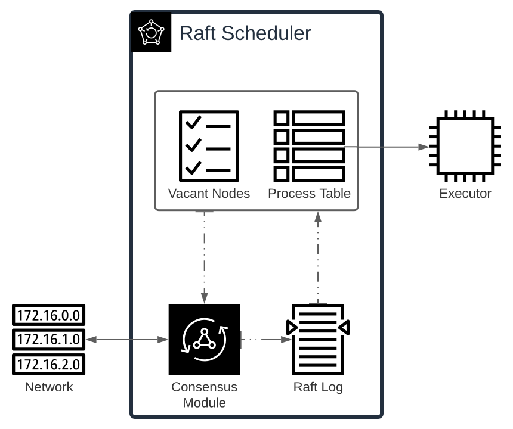

# Raft Scheduler
**Raft**, an alternative to Paxos, is a consensus algorithm which is similar to Paxos in fault-tolerance and performance, but decomposed into relatively independent subproblems and practically easier to implement.

You can learn more about this algorithm [here](https://raft.github.io/), which is a guide to the Raft [paper](https://raft.github.io/raft.pdf).

## **Significance**
The significance of this implementation is to understand the levers and gears of the Raft algorithm and to serve as the backbone for the cloud native distributed parallel execution engine, RaEx(Rust Parallel Executor), which would essentially be the compute engine for our experimental Ray Tracer, [rtrcrs](https://github.com/vyuham/rtrcrs/).

## Architecture

We make use of two types of *raft commands*, *Occupy* and *Vacate*, which are triggered by requests from a queue consisting of "To be scheduled" and "Completed" processes. Due to time constraints, we implement a soultion making use of the centralized queue, whereas it could be possible to use an alternative that fits in perfectly with out intent of building a completely distributed system.

The *raft commands* are applied to a *finite state machine* consisting of:
- Executing (Node => Processs): a mapping of nodes in the cluster to a process in execution, meaning the node is to run the task/process/execution-unit it is assigned.
- Free Nodes ([Node...]): a listing of nodes that are currently not executing any processes, ready to accomodate any that the scheduler may want to.

This implementation is written in [Rust](https://rust-lang.org/) and we use the [Tonic library](https://docs.rs/tonic) to implement, inter-node gRPC communication.

## **Related Projects**
- [dstore](https://github.com/vyuham/dstore) - Partially distributed memory store.
- [rtrcrs](https://github.com/vyuham/rtrcrs/) - Simple, CPU based ray tracer.
